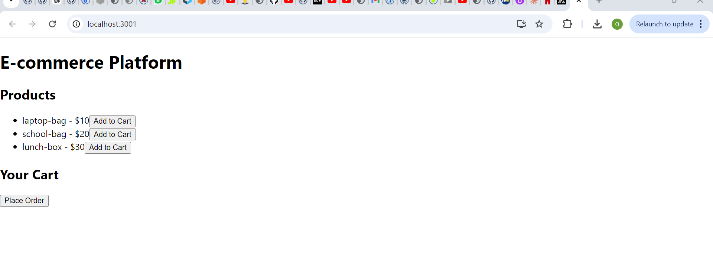

# E-commerce-Platform-Github-Actions

### NPM START

After installing the required dependencies for the API backend of the project, to run the application "npm start" was initiated as seen in the image above.

### Server.js content

This shows the content of the entry file "server.js" under the backend project structure.

### E-commerce API Running

After a couple of installation of the required dependencies, e-commerce API shows running.

### Github Actions Build & Deploy

The moment the application can run locally, it is then push to Github respository for Github Actions workflow and as seen in the image, it ran successfully.

### Order Created with Postman

Test API endpoints using `Postman`. Postman was downloaded locally and a new request initiated with `create order`. All necessary request configure using;
`Methods`: HTTP method (e.g `GET`, `POST`, `PUT`, `DELETE`) as well as `Request Body`.

### Postman login setup

The `Login` endpoint was configured and tested using `Postman` and this can be seen in the image. And the url "http://localhost:3000/api/login" return with `200 OK`.

### Postman Products setup

The `products` endpoint was configured and tested using `Postman` and this can be seen in the image. And the url "http://localhost:3000/api/products" return with `200 OK` and populated the listed products.

### Frontend E-commerce platform

This shows all the parameters specified in Postman to build the frontend interface especially the products. This is connecting the react frontend to backend API.

### Build & Deploy Backend

After a successful local build, then with `git push` to remote respository, the Github Actions workflow was started and completed successfully.

### Build & Deploy Frontend

This is the build & deploy output on Github Actions workflow after a successful build locally.

### Github Actions test

Tests for both backend & frontend was completed successfully as seen.

### Frontend Build

The output shows that with `npm run build` in the frontend directory, the application build was started as seen.

### Docker Integration

After pushing the docker image to docker hub respository successfully and the image up-to-date locally. 
However, before pushing i ensure to set up the required GitHub Secrets in the repository:

In GitHub repository
Under Settings > Secrets and variables > Actions
Add these secrets:

`DOCKER_USERNAME` - Docker Hub username
`DOCKER_PASSWORD` - Docker Hub access token

Furthermore, i initiated a push to remote repository for Github Actions workflow and the output is seen in the image above.